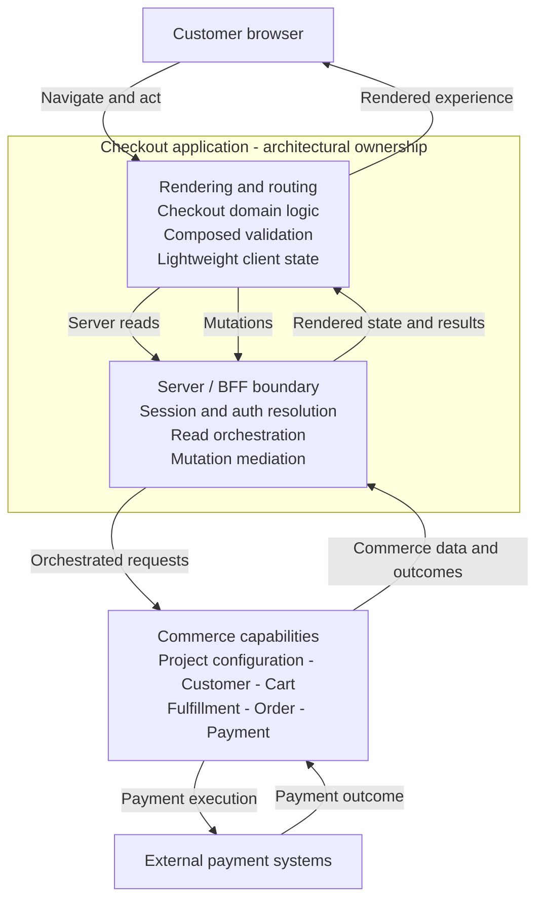
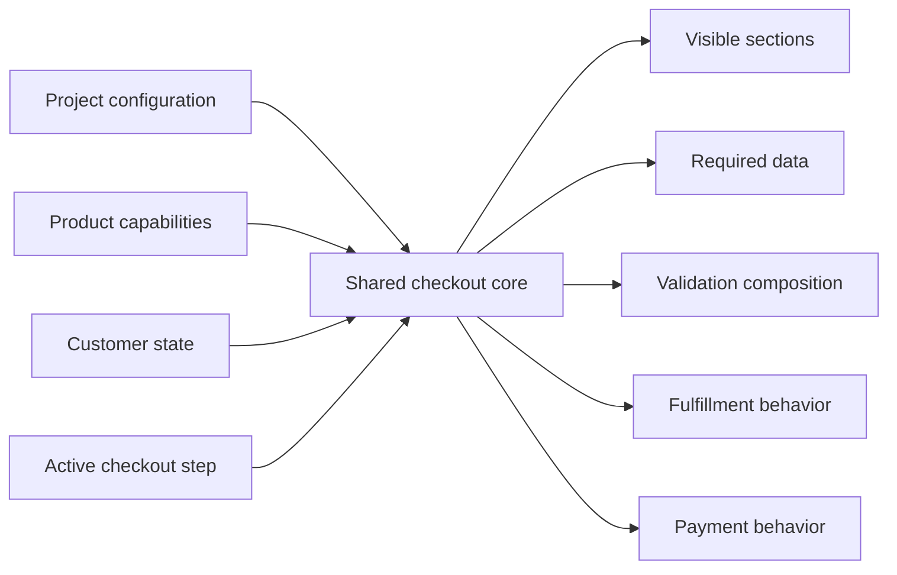
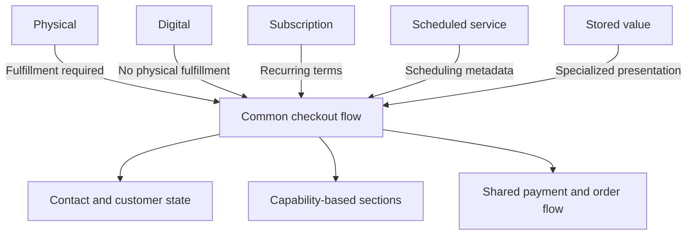
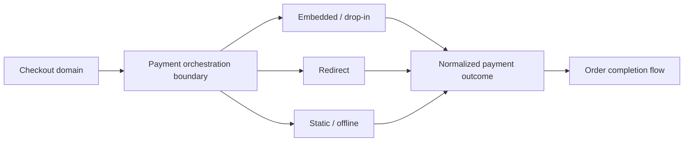
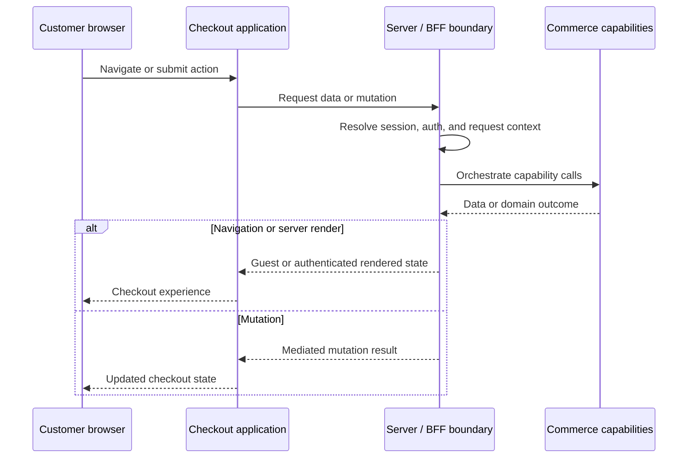

# UCRAFT Checkout

## Configuration-Driven SaaS Checkout Architecture

I architected and built UCRAFT Checkout from scratch as the sole engineer and took it through manual QA to production delivery. The production checkout supported 10 product types and 3 payment integration models.

**Role:** Senior Software Engineer / Sole Engineer

**Scope:** Architecture -> Implementation -> QA -> Production

**At a glance:** 10 product types | 3 payment integration models | 6 embedded/drop-in integrations | Single-page and multi-step | Guest and authenticated | Localized | Shipping and pickup

## Executive summary

The engineering goal was not to build one checkout for one storefront. It was to build a single checkout application that could adapt to different project configurations, product capabilities, customer states, fulfillment paths, and payment models across a SaaS website-building platform.

The resulting architecture kept the common purchase journey shared while deriving variable behavior from configuration and domain capabilities.

This repository is a clean-room engineering case study. It contains architectural explanations, independently reconstructed diagrams, and small illustrative examples, but no production source code or confidential configuration.

## The engineering problem

A multi-tenant SaaS checkout has several dimensions of variation at the same time:

- project-level settings determine which checkout experience is available;
- different product families require different information and fulfillment behavior;
- customer state changes account, address, and saved-payment behavior;
- single-page and guided journeys expose the same domain flow differently;
- payment methods follow fundamentally different integration models;
- localization affects both content and data formatting.

Implementing each combination separately would multiply code paths and make new integrations increasingly expensive. I designed the application around a stable checkout core, with explicit decision inputs controlling the parts that varied.

## High-level architecture

The checkout was an application boundary rather than only a collection of UI components. It owned rendering and routing, checkout domain decisions, validation composition, and lightweight client state. Its Next.js server/BFF boundary resolved session and authentication context, orchestrated reads, mediated mutations, and returned state appropriate for guest or authenticated customers.

[Mermaid source](diagrams/overall-architecture.mmd)

## Configuration-driven architecture

I chose one dynamic checkout instead of separate implementations for each project or checkout mode. Project configuration, product capabilities, customer state, and the active step formed a compact decision context. From that context, the application derived which sections to show, what data to collect, which validation to apply, and whether fulfillment or payment behavior was required.

This kept common behavior centralized while still allowing meaningful variation. Adding a supported configuration changed decision inputs and capability handling rather than introducing another checkout application.

[Mermaid source](diagrams/configuration-driven-checkout.mmd) | [Illustrative configuration example](examples/configuration-driven-behavior.ts)

## Supporting multiple product types

The inspected application represents ten product types. They share contact, customer, summary, payment, and order-completion concepts, but do not all require the same checkout behavior.

The architecture treated these differences as capabilities. Physical products could require shipping or pickup. Scheduled services carried date or time context. Digital, subscription, and stored-value products could omit physical fulfillment while contributing their own presentation requirements. The common flow remained intact instead of being duplicated by product type.

[Mermaid source](diagrams/product-architecture.mmd)

## Payment architecture

Payment handling was designed around integration behavior rather than a growing list of special cases. The application supports three payment models:

- **Embedded/drop-in:** payment interaction happens inside the checkout experience.
- **Redirect:** order placement produces a handoff to an external payment experience.
- **Static/offline:** the order records a method whose completion does not require an embedded SDK flow.

The inspected code includes six implemented embedded/drop-in integrations. Provider-specific initialization and submission behavior stayed behind a shared orchestration boundary, while the order flow consumed a normalized outcome.

[Mermaid source](diagrams/payment-architecture.mmd)

## Server-side API / BFF-style architecture

Backend communication was routed through the Next.js server layer. This boundary resolved request, session, and authentication context before retrieving checkout data or executing a mutation. It also allowed the initial response to be rendered for the correct guest or authenticated state without making the browser responsible for discovering that state after load.

The approach separated browser concerns from commerce capabilities and kept backend orchestration in an application-owned boundary. The diagram remains intentionally generic because service topology and request contracts are proprietary.

[Mermaid source](diagrams/server-request-flow.mmd)

## State architecture

Checkout state used lightweight, domain-oriented React stores and providers. This was a fit-for-purpose choice: data arrived in relatively consolidated domain responses, and the application did not have a large graph of independent client endpoints that justified a broader state platform.

State was divided by responsibility so checkout, payment, global project data, loading state, and UI state could evolve independently while retaining explicit domain operations. This kept dependencies and bundle overhead proportionate without sacrificing a clear state boundary.

[Illustrative lightweight-state example](examples/lightweight-domain-state.ts)

## Dynamic validation

Validation was composed from smaller concerns instead of being encoded in one universal schema containing every branch. The active checkout configuration, product capabilities, customer state, payment requirement, and current step determined which validation units participated.

That structure kept each rule understandable and allowed single-page and guided journeys to reuse the same underlying concerns. Product-specific requirements could be included only when relevant.

[Illustrative composable-validation example](examples/composable-validation.ts)

## Performance architecture

Performance influenced architectural boundaries from the beginning. Conditional surfaces and payment integrations were split so that an integration SDK was loaded only when its flow was needed. Independent server reads were orchestrated together where possible, and server rendering reduced the amount of state discovery required after the browser loaded.

Next.js route composition supported both single-page and multi-step experiences. Parallel Routes were used for authentication-related modal surfaces, allowing those interactions to participate in routing while remaining compositionally separate from the primary checkout flow.

## Production outcome

I took the application through manual QA and production delivery. The resulting checkout supported configuration-driven merchant experiences across product, fulfillment, customer, localization, and payment variations while retaining one shared architectural core.

## What I would improve today

I would keep the core architecture and evolve two areas:

1. Add automated regression coverage around payment orchestration, composed validation, checkout state transitions, and product-specific flows.
2. As embedded integrations grow, replace direct provider selection with a typed adapter registry that makes capability and lifecycle contracts more explicit.

The [typed payment adapter registry example](examples/payment-provider-registry.ts) illustrates the second improvement only. It is a present-day evolution and does not describe the original production implementation.

## Technologies

- Next.js and React
- TypeScript
- React Hook Form and Zod
- next-intl
- Radix UI and Tailwind CSS
- Payment provider SDK integrations

## Proprietary-source disclaimer

UCRAFT Checkout is proprietary software. This repository is an independently written portfolio case study based on architectural analysis and the author's project experience. It includes no UCRAFT production source code, backend locations, private configuration, or infrastructure details.

The diagrams and TypeScript examples are simplified clean-room reconstructions created specifically to communicate engineering decisions. They are not extracts from the production application and should not be interpreted as its implementation or as a grant of rights to the underlying proprietary system.
